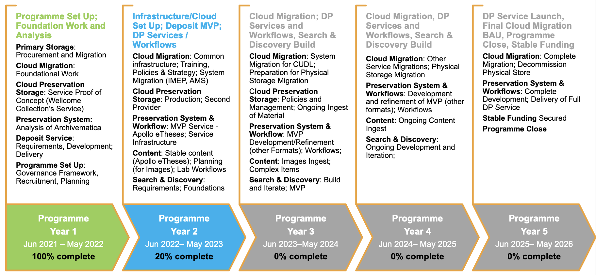

# Digital Preservation Programme

## About and Background

Funded by Cambridge University, and approved by the University’s Planning and Resource Committee, in October 2020, the Digital Preservation Programme is a five-year programme of work that will deliver organisation-wide change in how the Libraries' digital collection materials are managed.  

The Programme’s scope includes activities found within stages of a lifecycle of collection management for digital materials, and as such it will deliver capabilities to manage digital materials throughout this lifecycle. The result will be the Cambridge University Libraries Digital Preservation Service that will provide sustainable and integrated capabilities to manage digital collections that underpin digital scholarship now and over time.  

## Objectives

* Central place to store and manage digital materials
* Improve end-to-end workflows reducing manual steps
* Migrate to cloud, optimised where possible, reducing operational costs
* Improve search, discovery, and access across digital collection materials

## Team

The core Digital Preservation Programme team is made up of staff on teams within the Libraries' Digital Initiatives directorate as well as staff within the Libraries' Programme Support Office: 

* Natalie Adams, Metadata Specialist  
* Ceri Bennett, Project Manager
* Nick Butler, Senior Developer & Operations Specialist 
* John Gostick, Technical Lead
* Lesley Gray, Deputy Director of Digital Initiatives   
* Jenny Grewcock, Head of Programme Support Office
* Peter Heiner, Senior Developer & Operations Specialist
* Jay Pema, Head of Digital Services
* Tuan Pham, Head of Digital Development & Innovation
* Caylin Smith, Head of Digital Preservation 
* Leontien Talboom, Technical Analyst 

The team works with colleagues across the Libraries in Archives & Modern Manusripts, Scholarly Communications, Open Research Systems, the Digital Content Unit, and others to understand content and user needs to deliver services that are fit for purpose. 