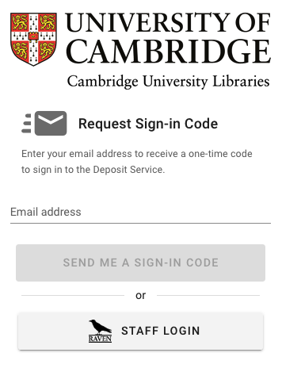

# Deposit Service
The Deposit Service is an online tool that can be used to transfer digital files to the Library safely and securely.

## 1. Before you start
Liaise with Cambridge University Library to:
* Decide which records to deposit
* Identify any records containing sensitive or confidential information
* Discuss the terms of deposit/donation including assignment of copyright
* Prepare a list (ideally a spreadsheet) of the files and directories you plan to transfer. Your
contact at the Library can supply a spreadsheet template that can be used for this purpose.

## 2. Sign-in
* Visit the Deposit Service
* Request a Sign-in Code by filling in your e-mail address and clicking the <em>SEND ME A SIGN-IN CODE button</em>.

* Check your email account for an email from deposit@dps.lib.cam.ac.uk with the subject line **‘Sign-in** code for Cambridge University Libraries’ Deposit Service’.
* Enter the 6 -figure sign-in code in the email into the Deposit Service Sign in page (shown below)
and click the **CONTINUE** button

## 3. Upload files
* Enter the 6 -figure sign-in code in the email into the Deposit Service Sign in page (shown below)
and click the CONTINUE button
* Visit the Deposit Service
* Sign in to the Deposit Service using a one-time code
* You will see a screen (as shown below) showing an area for deposit of your files.
* Click the white arrow in a blue circle (see red arrow in image above)
* Click UPLOAD FILES
* Click ‘Add files’ next to the paper clip icon to a view of the directories on your computer
* Select the file or files you wish to upload
* Click ‘Open’ to upload files to the Deposit Service
* Continue until all the files you wish to transfer have been uploaded- remember to include a list
or spreadsheet of the files

## 4. Deleting files after upload
To delete files from the Deposit Service
* Click the white cross in a red circle next to the file to be deleted.
* When prompted, click OK to delete the file.

## 5. Signing out
Click **Sign out** in the bottom left corner of the screen to sign out of the Deposit Service.

## 6. Finish
After you have finished uploading all the files you wish to transfer to the Library to the Deposit
Service, notify your contact at the Library or email [digitalpreservationservice@lib.cam.ac.uk.](mailto:digitalpreservation@lib.cam.ac.uk)
