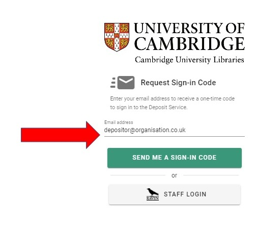
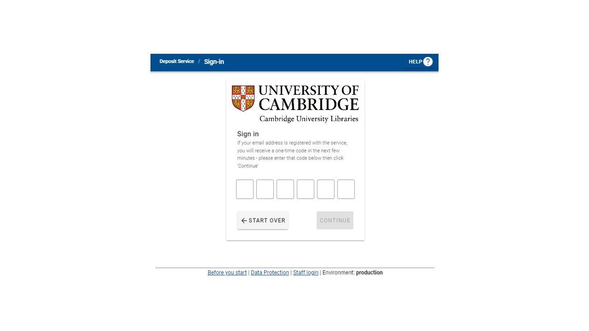
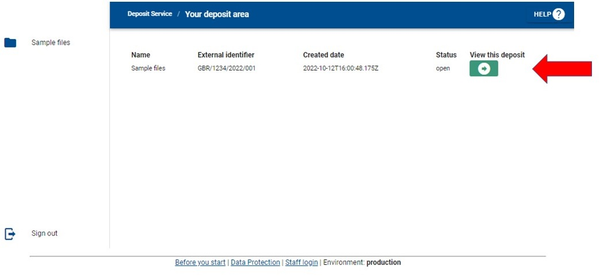
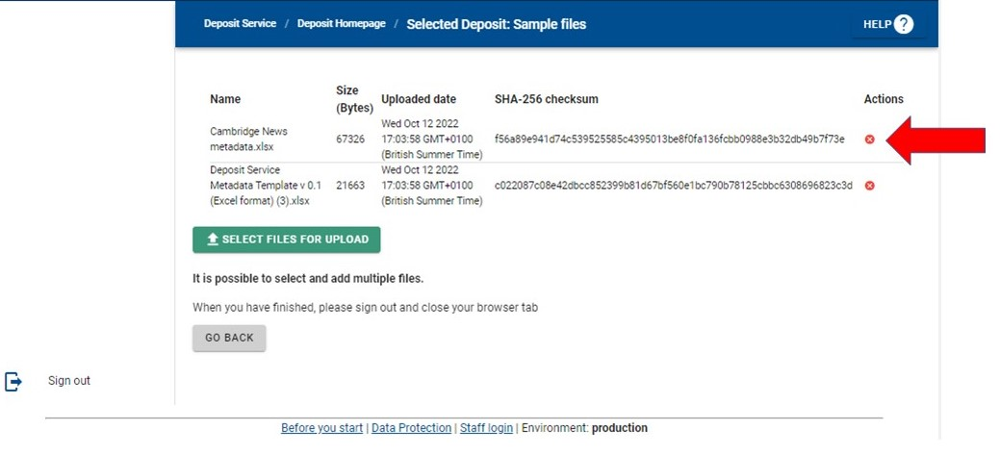
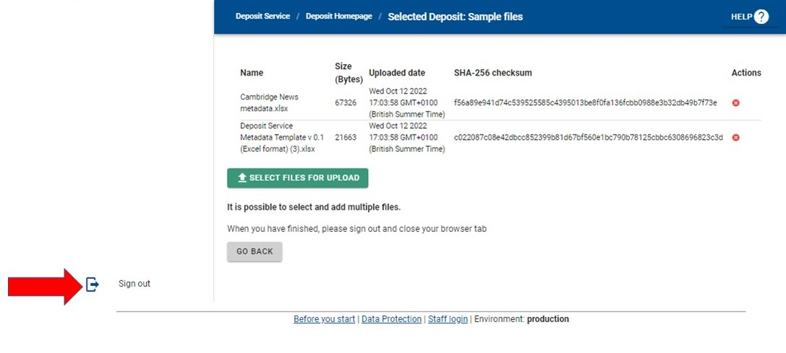

# Deposit Service

The Deposit Service is an online service for transferring digital files to Cambridge University Libraries (CUL) safely and securely. 

It has been developed by CUL’s Digital Preservation Programme to support CUL’s mission to acquire world-class information resources. CUL welcome offers of material that would enhance their collections.

Further information about [CUL collecting policies](https://www.lib.cam.ac.uk/about-library/library-management/policies.html) is available online.

## 1. Before you start

Liaise with your contact at CUL to:

* Decide which records to deposit
* Identify any records containing sensitive or confidential information
* Discuss the terms of deposit/donation including assignment of copyright
* Prepare a list (ideally a spreadsheet) of the files and directories you plan to transfer. Your
contact at the Library can supply a spreadsheet template that can be used for this purpose.

## 2. Sign-in

* Visit the [Deposit Service](https://deposit.dps.lib.cam.ac.uk/)
* Request a Sign-in Code by filling in your e-mail address and clicking the _**send me a sign in code**_ button.

* Check your email account for an email from deposit@dps.lib.cam.ac.uk with the subject line **_Sign-in code for Cambridge University Libraries’ Deposit Service._**    
* Enter the 6 -figure sign-in code in the email into the Deposit Service Sign in page and click the **_continue_** button

## 3. Upload files
* Enter the 6 -figure sign-in code in the email into the Deposit Service **_Sign in_**  page 
and click the **_continue_** button
* Visit the Deposit Service
* Sign in to the Deposit Service using a one-time code
* You will see a screen showing an area for deposit of your files.

* Click the white arrow in a green circle
* Click **_upload files_**
* Click **_Add files_** next to the paper clip icon to a view of the directories on your computer
* Select the file or files you wish to upload
* Click **_Open_** to upload files to the Deposit Service
* Continue until all the files you wish to transfer have been uploaded- remember to include a list or spreadsheet of the files

## 4. Deleting files after upload
To delete files from the Deposit Service
* Click the white cross in a red circle next to the file to be deleted.
* When prompted, click _OK_ to delete the file.

## 5. Signing out
Click **_Sign out_** in the bottom left corner of the screen to sign out of the Deposit Service.

## 6. Finish
After you have finished uploading all the files you wish to transfer to the Library to the Deposit
Service, notify your contact at the Library or email [digitalpreservationservice@lib.cam.ac.uk.](mailto:digitalpreservation@lib.cam.ac.uk)
