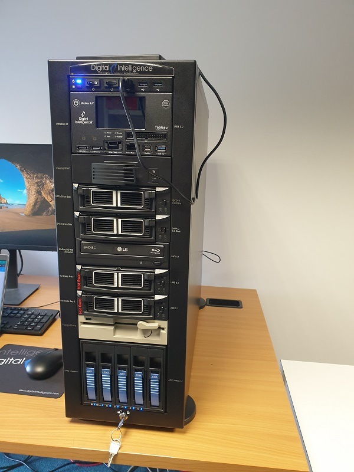

# Transfer Service
Within the Library a large number of carriers with digital material on them can be found. As some of these carriers have become obsolete and fragile, the Transfer Service offers a place to extract the content off of these carriers. At this point in time, the processes and workflows for the Transfer Service are a work in progress.

As part of the transfer service a Forensic Workstation (FRED) is being used. Currently the FRED is able to transfer material from the following carriers:

* 3.5-inch floppy disks
* 5.25-inch floppy disks
* Hard drives
* Multimedia Card Formats
* ZIP Disks
* Memory Sticks and USB-Flash Drives
* Optical Discs (CD/DVD/Blu-Ray)

